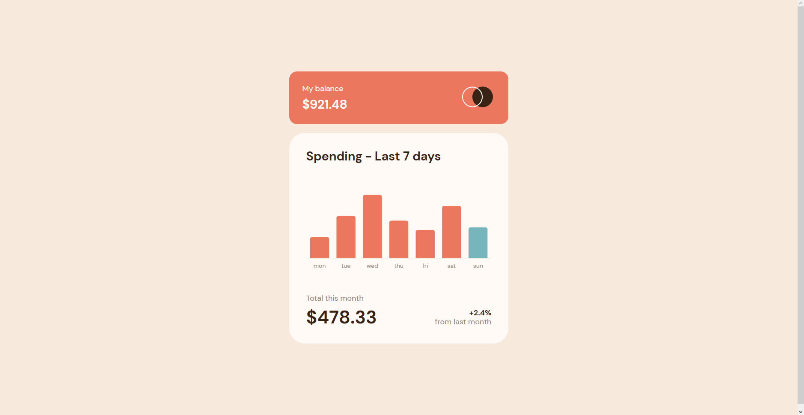

# Frontend Mentor - Expenses chart component solution

This is a solution to the [Expenses chart component challenge on Frontend Mentor](https://www.frontendmentor.io/challenges/expenses-chart-component-e7yJBUdjwt). Frontend Mentor challenges help you improve your coding skills by building realistic projects.

## Table of contents

- [Overview](#overview)
  - [The challenge](#the-challenge)
  - [Screenshot](#screenshot)
  - [Links](#links)
- [My process](#my-process)
  - [Built with](#built-with)
  - [What I learned](#what-i-learned)
  - [Useful resources](#useful-resources)
- [Author](#author)

## Overview

### The challenge

Users should be able to:

- View the bar chart and hover over the individual bars to see the correct amounts for each day
- See the current day’s bar highlighted in a different colour to the other bars
- View the optimal layout for the content depending on their device’s screen size
- See hover states for all interactive elements on the page
- **Bonus**: Use the JSON data file provided to dynamically size the bars on the chart

### Screenshot

### Links

- Solution URL: 

## My process

### Built with

- Semantic HTML5 markup
- CSS custom properties
- Flexbox
- Mobile-first workflow
- [Chart JS](https://www.chartjs.org) - vanilla JS library for making charts

### What I learned

Before the challenge, I assumed that creating charts is not a problem, and it would be the piece of cake. And then I have spend an hour just to make the tooltip... Fortunately, I know the [Chart JS](https://www.chartjs.org) documentation in and out right now, and have more experience at it.

### Useful resources

- [Using CSS variables (color) with chart.js](https://stackoverflow.com/questions/49208780/using-css-variables-color-with-chart-js-var-primarycolor-not-working) - Since I have used css variables, the StackOverflow solution provided with a way of using those in JavaScript.

## Author

- Frontend Mentor - [@skyrimer](https://www.frontendmentor.io/profile/skyrimer)
